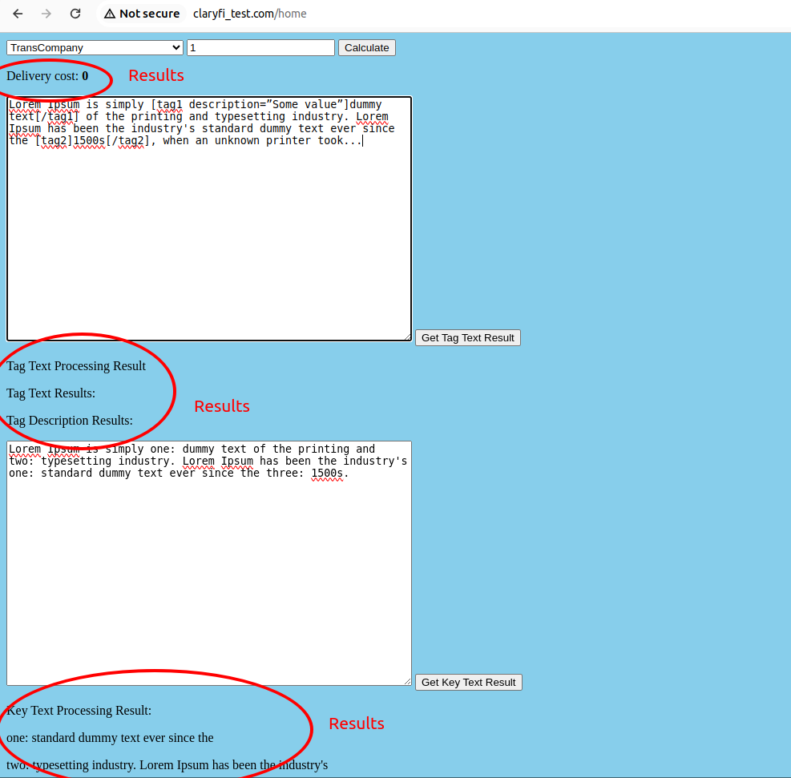

 
Deviations from original task: 
1. In original task there should have been two repositories with test task #1 and test task #2. I did everything in one repository, because I don't see any reason to repead code and set up two projects. 
2. The front end was simplified as much as possible because I am back-end developer and I have zero experience with vue.js. 
3. The structure of the Task#1 differs a little bit from the task requirements because it seemed logically to build it closer to Factory Method pattern then to what was in the task.  
4. In the original task there was a requirement to build ui-container in docker. I don't really see the need for such structure and as I mentioned I haven't worked with vue, so I ded front and back both in one fpm-container. 
 
 

To start the project run 'docker compose up -d --build'  
If something goes wrong, run 'docker compose down' and then 'docker system prune -a' that will delete all containers to start from 'fresh start'. 
If you were runnig kubernetes before you need to delete all images in kubernetes context too because there are sometimes conflicts between images and containers.  
Very rarely but if you on Ubuntu sometimes you eve need to restart it and then run 'docker system prune -a'   
Put '127.0.0.1       claryfi_test.com' into /etc/hosts.  
To get into fpm container 'docker exec -it claryfi_test-fpm-1 bash'  
cd app, yarn install, yarn build or yarn watch  
You'll see your app on http://claryfi_test.com/ (not https://claryfi_test.com/) 

